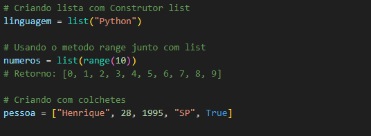
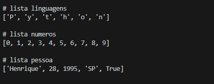
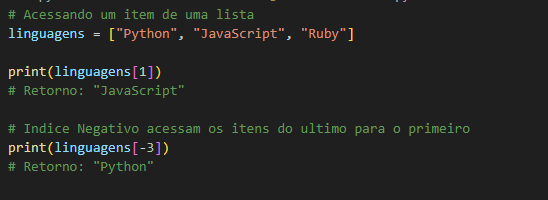
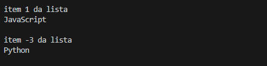
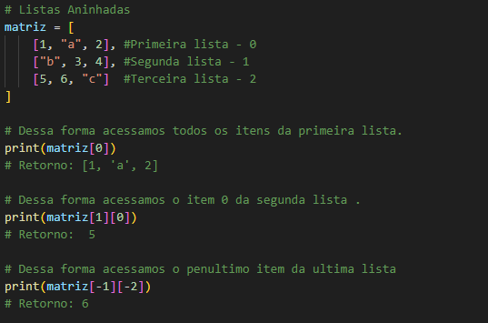
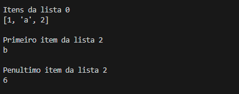

<h1 aling="center">Listas com Python</h1>

  - Listas podem armazenar qualquer tipo de objeto de forma sequencial.
  - Existem **3 formas** para criar uma lista em Python, utilizando o construtor **list**, a função **range** ou colocando valores separados por virgulas dentro de colchetes.
  - Lembrando que listas são **objetos mutaveis**, então podemos **alterar** os dados dentro dela.

<!-- Criando listas -->
<h2>Como Criar uma lista</h2>
  
  <h3>Exemplo:</h3>
  

  <h3>Retorno:</h3>
  

  <h3>Código para copiar:</h3>
  <blockquote>

    # Criando lista com Construtor list
    linguagens = list("Python")

    # Usando o metodo range junto com list
    numeros = list(range(10))
    # Retorno: [0, 1, 2, 3, 4, 5, 6, 7, 8, 9]

    # Criando com colchetes
    pessoa = ["Henrique", 28, 1995, "SP", True]
  
  </blockquote>

<!-- Acessando listas diretamente -->
<h2>Como Acessar Listas Diretamente</h2>

  <h3>Exemplo:</h3>
  

  <h3>Retorno:</h3>
  

  <h3>Código para copiar:</h3>
  <blockquote>
  
    linguagens = ["Python", "JavaScript", "Ruby"]

    print("\n")
    print(linguagens[1])
    # Retorno: "JavaScript"

    # Indice Negativo acessam os itens do ultimo para o primeiro 
    print(linguagens[-3])
    # Retorno: "Python"
  
  </blockquote>

<!-- Listas aninhadas -->
  - Listas aninhadas são listas dentro de listas.

  <h3>Exemplo:</h3>
  

  <h3>Retorno:</h3>
  

  <h3>Código para copiar:</h3>
  <blockquote>
  
    matriz = [
        [1, "a", 2], #Primeira lista - 0
        ["b", 3, 4], #Segunda lista - 1
        [5, 6, "c"]  #Terceira lista - 2
    ]

    # Dessa forma acessamos todos os itens da primeira lista.
    print(matriz[0])
    # Retorno: [1, 'a', 2]

    # Dessa forma acessamos o item 0 da segunda lista .
    print(matriz[1][0])
    # Retorno:  5

    # Dessa forma acessamos o penultimo item da ultima lista
    print(matriz[-1][-2])
    # Retorno: 6

  </blockquote>

<!-- Fatiamento de Listas -->

<!-- Iterar/Percorrer listas -->

<!-- Função enumerate -->

<!-- Compreensão de listas -->