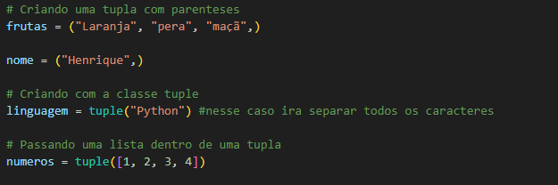
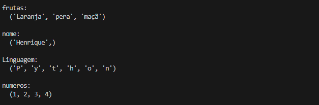
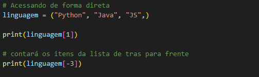
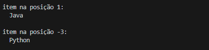
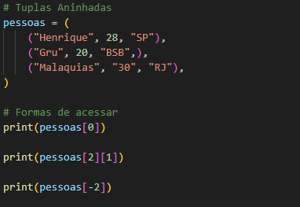
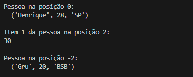
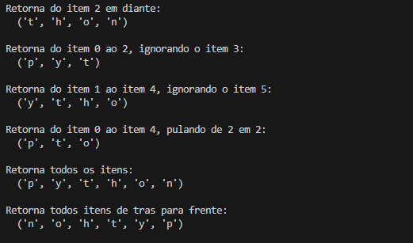
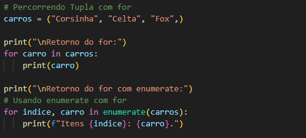
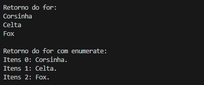

<h1 align="center">Criando e Formas de Acesssar uma Tupla</h1>
<!-- criando uma tupla -->
<h2>Como Criar uma Tupla</h2>

  - Podemos criar usando a classe tuple ou colocando os dados separados por virgula dentro de parenteses.
  - Um ponto a se lembrar quando usamos tuplas é sempre deixar uma virgula no final após o ultimo dado, dessa forma o Python entenderá que é uma tupla.

  <h3>Exemplo:</h3>
  

  <h3>Retorno:</h3>
  

  <h3>Código para copiar:</h3>
  <blockquote>

    frutas = ("Laranja", "pera", "maçã",)

    nome = ("Henrique",)

    # Criando com a classe tuple
    linguagem = tuple("Python") #nesse caso ira separar todos os caracteres

    # Passando uma lista dentro de uma tupla
    numeros = tuple([1, 2, 3, 4])
  
  </blockquote>
   

___
<!-- acessando uma tupla -->
<h2>Formas de Acessar uma Tupla</h2>

  - As formas de acessar uma tupla é igual a de uma lista, podemos acessar diretamento colocando o número do indice e também com valores negativos.

  <h3>Exemplo:</h3>
  

  <h3>Retorno:</h3>
  

  <h3>Código para copiar:</h3>
  <blockquote>

    linguagem = ("Python", "Java", "JS",)

    print(linguagem[1])

    # contará os itens da lista de tras para frente
    print(linguagem[-3])
  
  </blockquote>
   

___
<!-- tuplas aninhadas -->
<h2>Tuplas Aninhadas</h2>

  - São tuplas dentro de tuplas, da mesma forma como em listas aninhadas.

  <h3>Exemplo:</h3>
  

  <h3>Retorno:</h3>
  

  <h3>Código para copiar:</h3>
  <blockquote>
  
    pessoas = (
        ("Henrique", 28, "SP"),
        ("Gru", 20, "BSB",),
        ("Malaquias", "30", "RJ"),
    )

    # Formas de acessar
    print(pessoas[0])

    print(pessoas[2][1])

    print(pessoas[-2])

  </blockquote>
   

___
<!-- fatiamento -->
<h2>Fatiamento de Tuplas</h2>

  - Da mesma forma que fatiamos strings e listas, podemos fazer fatiamento de tuplas.

  <h3>Exemplo:</h3>
  

  <h3>Retorno:</h3>
  

  <h3>Código para copiar:</h3>
  <blockquote>
  
    tupla = ("p", "y", "t", "h", "o", "n",)

    print(tupla[2:])
    print(tupla[:3])
    print(tupla[1:5])
    print(tupla[0:5:2])
    print(tupla[::])
    print(tupla[::-1])

  </blockquote>
   

___
<!-- percorrendo uma tupla com for e enumerate -->
<h2>Como Percorrer uma Tupla</h2>

  - Podemos usar o for e o enumerate para percorrer-mos uma tupla.

  <h3>Exemplo:</h3>
  

  <h3>Retorno:</h3>
  

  <h3>Código para copiar:</h3>
  <blockquote>
  
    carros = ("Corsinha", "Celta", "Fox",)

    print("\nRetorno do for:")
    for carro in carros:
        print(carro)

    print("\nRetorno do for com enumerate:")
    # Usando enumerate com for
    for indice, carro in enumerate(carros):
        print(f"Itens {indice}: {carro}.")

  </blockquote>
   

___
