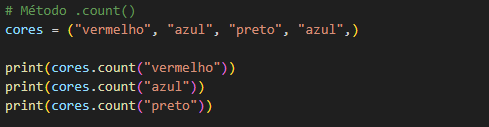
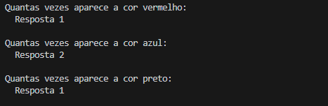
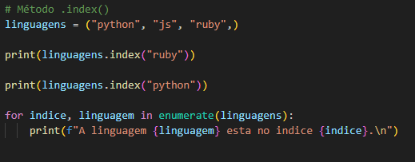
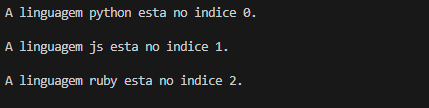
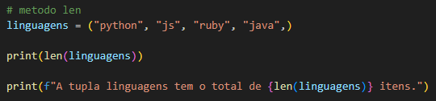
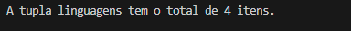

<h1>Métodos da Classe de Tupla</h1>

  - As tuplas tem menos métodos para usarmos do que as listas.

<!-- metodo .count -->
<h2>Método count</h2>

  - Utilizado para contar quantas vezes um determinado dado aparece em uma Tupla, da mesma forma que usamos em listas.
  <h3>Exemplo:</h3>
  

  <h3>Retorno:</h3>
  

  <h3>Código para copiar:</h3>
  <blockquote>
  
    cores = ("vermelho", "azul", "preto", "azul",)

    print(cores.count("vermelho"))
    print(cores.count("azul"))
    print(cores.count("preto"))

  </blockquote>
   

___
<!-- método .index -->
<h2>Método index</h2>
  - Ele retorna quando foi a primeira ocorrencia de um determinado dado, entre outras palavras, a posição que um dado apareceu a primeira vez em uma Tupla.

  <h3>Exemplo:</h3>
  

  <h3>Retorno:</h3>
  

  <h3>Código para copiar:</h3>
  <blockquote>
  
    linguagens = ("python", "js", "ruby",)

    print(linguagens.index("ruby"))

    print(linguagens.index("python"))

    for indice, linguagem in enumerate(linguagens):
        print(f"A linguagem {linguagem} esta no indice {indice}.\n")
        
  </blockquote>
   

___
<!-- método len -->
<h2>Método len</h2>

  - Ele retorna quantos itens tem em uma lista.

  <h3>Exemplo:</h3>
  

  <h3>Retorno:</h3>
  

  <h3>Código para copiar:</h3>
  <blockquote>
  
    linguagens = ("python", "js", "ruby", "java",)

    print(len(linguagens))

    print(f"A tupla linguagens tem o total de {len(linguagens)} itens.")

  </blockquote>
   

___