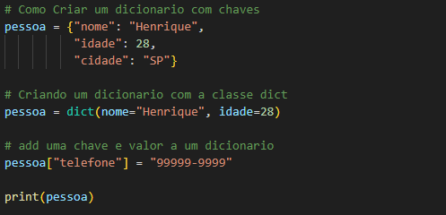
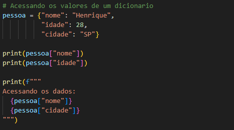
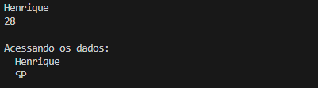
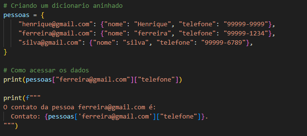
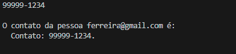
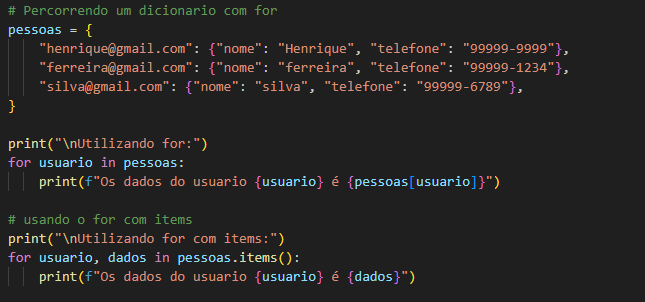
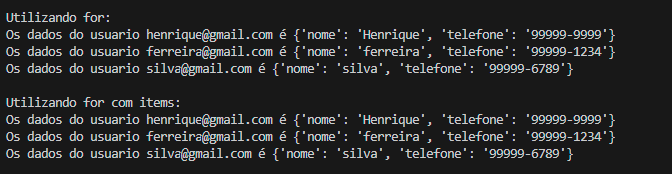

<h1 align="center">Criando e Acessando um Dicionario em Python</h1>

  - Para criarmos um dicionário podemos utilizar as chaves{} ou a classe dict.
  - Dicionários são formados de chaves e valores como por exemplo nome="Henrique".

<h2>Criando um Dicionário</h2>

  <h3>Exemplo:</h3>
  
  
  <h3>Código para copiar:</h3>
  <blockquote>
  
    pessoa = {"nome": "Henrique",
              "idade": 28,
              "cidade": "SP"}

    # Criando um dicionario com a classe dict
    pessoa = dict(nome="Henrique", idade=28)

    # add uma chave e valor a um dicionario
    pessoa["telefone"] = "99999-9999"

  </blockquote>
   

___
<h2>Acessando um Dicionario</h2>

  <h3>Exemplo:</h3>
  
  
  <h3>Retorno:</h3>
  

  <h3>Código para copiar:</h3>
  <blockquote>
  
    pessoa = {"nome": "Henrique",
              "idade": 28,
              "cidade": "SP"}

    print(pessoa["nome"])
    print(pessoa["idade"])

    print(f"""
    Acessando os dados:
      {pessoa["nome"]}
      {pessoa["cidade"]}
    """)
  </blockquote>  
   

___

<!-- dicionarios aninhados -->
<h2>Dicionarios Aninhados</h2>

  - Da mesma forma de listas e tuplas, são dicionarios dentro de dicionarios.

  <h3>Exemplo:</h3>
  

  <h3>Retorno:</h3>
  

  <h3>Código para copiar:</h3>
  <blockquote>
  
    pessoas = {
        "henrique@gmail.com": {"nome": "Henrique", "telefone": "99999-9999"},
        "ferreira@gmail.com": {"nome": "ferreira", "telefone": "99999-1234"},
        "silva@gmail.com": {"nome": "silva", "telefone": "99999-6789"},
    }

    # Como acessar os dados
    print(pessoas["ferreira@gmail.com"]["telefone"])

    print(f"""
    O contato da pessoa ferreira@gmail.com é: 
      Contato: {pessoas['ferreira@gmail.com']["telefone"]}.
    """)

  </blockquote>
   

____

<!-- percorrer dicionario -->
<h2>Como Percorrer um Dicionário</h2>

  - Podemos percorrer utilizando o for e também o for com o items, parecido com o enumerate más usando a palavra reservada items.

  <h3>Exemplo:</h3>
  

  <h3>Retorno:</h3>
  

  <h3>Código para copiar:</h3>
  <blockquote>
  
    pessoas = {
        "henrique@gmail.com": {"nome": "Henrique", "telefone": "99999-9999"},
        "ferreira@gmail.com": {"nome": "ferreira", "telefone": "99999-1234"},
        "silva@gmail.com": {"nome": "silva", "telefone": "99999-6789"},
    }

    print("\nUtilizando for:")
    for usuario in pessoas:
        print(f"Os dados do usuario {usuario} é {pessoas[usuario]}")

    # usando o for com items
    print("\nUtilizando for com items:")
    for usuario, dados in pessoas.items():
        print(f"Os dados do usuario {usuario} é {dados}")
        
  </blockquote>