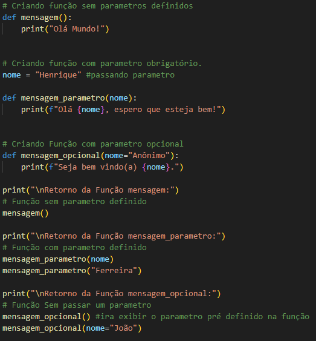
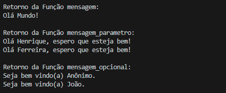

<h1>Criando e Exibindo Funções</h1>

  - Para criarmos uma função nós usamos a palavra reservada def e criamos um nome para a função.
  - o nome da função se tiver mais de uma palavra tem que ser separado usando underline e colocar parenteses no final, exemplo exibir_mensagem()

<h2>Formas de Criar Uma Função</h2>

  Irei deixar 3 formas de criar uma função.
  - A primeira mais basica com apenas o nome da função.

  - A segunda alem do nome colocaremos um argumento dentro da função, esse argumento terá que ter sido definido antes de chamar a função.   
  Caso não passe o parametro na hora de chama-la será retornado um erro.

  - A terceira nós colocaremos um argumento opcional, nesse caso se o argumento não tiver sido passado antes de chamar a função ele terá um argumento já deixado previamente na hora de declarar a função.  
  Caso não passe um parametro ele irá retornar o parametro definido na função.

  <h3>Exemplo:</h3>
  

  <h3>Retorno:</h3>
  

  <h3>Código para copiar:</h3>
  <blockquote>
  
    def mensagem():
        print("Olá Mundo!")

    # Criando função com parametro obrigatório.
    nome = "Henrique" #passando parametro

    def mensagem_parametro(nome):
        print(f"Olá {nome}, espero que esteja bem!")

    # Criando Função com parametro opcional
    def mensagem_opcional(nome="Anônimo"):
        print(f"Seja bem vindo(a) {nome}.")

    print("\nRetorno da Função mensagem:")
    # Função sem parametro definido
    mensagem()

    print("\nRetorno da Função mensagem_parametro:")
    # Função com parametro definido
    mensagem_parametro(nome)
    mensagem_parametro("Ferreira")

    print("\nRetorno da Função mensagem_opcional:")
    # Função Sem passar um parametro
    mensagem_opcional() #ira exibir o parametro pré definido na função
    mensagem_opcional(nome="João")

  </blockquote>