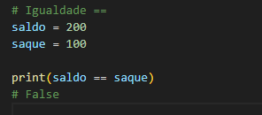

<h1 align=center>Operadores de Comparação</h1>

<h3>Quais são os Operadores de Comparação?</h3>

- Igualdade.  
  - Usando os sinais ==  
    <code>Exemplo:</code>  
      

- Difença.  
  - Usando os sinais !=  
    <code>Exemplo:</code>  
      

- Maior / Maior ou igual.  
  - Maior usando o sinal >  
  - Maior ou Igual usando os sinais >=  
    <code>Exemplo:</code>  
      

- Menor / Menor ou igual.
   - Menor usando o sinal <  
   - Menor ou Igual usando os sinais <=  
    <code>Exemplo:</code>  
    